# 🚀 Omnichannel Data Pipeline & Modern Data Warehouse

An end-to-end Data Warehouse and Orchestration solution designed to analyze Omnichannel Marketing performance, provide RAG-ready data for AI Agents, and operate autonomously via Apache Airflow.

## 1. Project Overview
This project simulates a modern data platform for an omnichannel business. It tackles the complete data lifecycle: from extracting raw transactional data to orchestrating complex transformations, ensuring data quality, and triggering real-time monitoring alerts. 

The core objective is to build a highly scalable, automated, and cost-efficient pipeline that bridges Data Engineering (Containerization & Orchestration) and Data Analytics (Dimensional Modeling & BI).

## 2. Tech Stack & Architecture

Below is the breakdown of the infrastructure components and their respective roles within the data platform:

| Layer | Component | Technology | Description |
| :--- | :--- | :--- | :--- |
| **Data Warehouse** | Storage & Compute | ☁️ **Google BigQuery** | Highly scalable cloud data warehouse acting as the central storage for both raw and transformed data. |
| **Transformation** | Data Modeling | 🔨 **dbt Core** | Executes SQL-based transformations, handles data testing, and maintains the dimensional modeling architecture. |
| **Orchestration** | Scheduler | 🌀 **Apache Airflow** | Containerized task orchestrator managing the daily pipeline lifecycle (Testing ➔ Staging ➔ Marts). |
| **Environment** | Containerization | 🐳 **Docker Compose** | Ensures isolated and consistent local environments for Airflow and its dependencies. |
| **Monitoring** | Alerting System | 🤖 **Telegram API** | Custom Python integration within the Airflow DAG to push real-time success/failure notifications to mobile. |
| **Visualization** | BI Tool | 📊 **Looker Studio** | Connects directly to BigQuery Marts to serve interactive dashboards for business stakeholders. |


## 3. Data Modeling & Technical Highlights (The Optimizer Mindset)
The data transformation logic follows the **Medallion Architecture**, strictly implemented within Google BigQuery using dbt:

* **Raw Layer:** As-is transactional data from CRM, TikTok Ads, and Meta Ads.
* **Staging Layer:** Data cleaning, explicit type casting, and schema standardization.
* **Intermediate Layer:** Complex business logic execution.
* **Mart Layer:** Optimized Star Schema (Fact/Dim) designed for BI tools and LLM consumption.

**Technical Achievements:**
* **Cost Optimization:** Implemented `Incremental Materialization` alongside `Partitioning & Clustering` on BigQuery, reducing data scan volume by up to 90%.
* **Dimension Modeling (SCD Type 2):** Managed Creator lifecycle and follower history using `LEAD()` window functions to ensure accurate point-in-time reporting.
* **Data Quality Assurance:** Integrated 50+ automated data tests (`unique`, `not_null`, `accepted_values`, `relationships`) to maintain referential integrity and establish a "Single Source of Truth."
* **AI-Native Engineering:** Developed a specialized `dim_creator_knowledge_base` that flattens metrics and internal reviews into structured Text Blobs, ready for Vector Embedding and RAG (Retrieval-Augmented Generation) applications.

## 4. Data Pipeline Flow
The system operates in two synchronized dimensions: the **Orchestration Flow** (controlled by Airflow) and the **Data Transformation Flow** (executed by dbt inside BigQuery).

### 🗺️ End-to-End Architecture Diagram

```mermaid
flowchart LR
    %% ========== DATA SOURCES ==========
    subgraph SRC["📥 Data Sources"]
        direction TB
        CRM["CRM"]
        TIKTOK["TikTok Ads"]
        META["Meta Ads"]
    end

    %% ========== ORCHESTRATION ==========
    AIRFLOW["🌀 <b>Apache Airflow</b><br/>🐳 Docker Compose<br/><i>Daily Scheduler</i>"]

    %% ========== WAREHOUSE + DBT ==========
    subgraph WH["☁️ Google BigQuery &nbsp;·&nbsp; 🔨 dbt Core (Medallion Architecture)"]
        direction TB
        RAW["<b>Raw Layer</b><br/>As-is transactional data"]
        STG["🥉 <b>Staging (Bronze)</b><br/>Cleaning · Type Casting · Dedup"]
        INT["🥈 <b>Intermediate (Silver)</b><br/>Business Logic<br/>SCD Type 2 — LEAD() / LAG()"]
        MART["🥇 <b>Mart (Gold)</b><br/>Star Schema (Fact / Dim)<br/>Incremental · Partition · Cluster<br/>dim_creator_knowledge_base"]
        RAW --> STG --> INT --> MART
    end

    %% ========== CONSUMPTION ==========
    subgraph BI["🎯 Consumption"]
        direction TB
        LOOKER["📊 <b>Looker Studio</b><br/>BI Dashboards"]
        LLM["🧠 <b>LLM / RAG</b><br/>AI Applications"]
    end

    %% ========== MONITORING ==========
    TG["🤖 <b>Telegram API</b><br/>Real-time Alerts"]

    %% ========== FLOWS ==========
    CRM    --> AIRFLOW
    TIKTOK --> AIRFLOW
    META   --> AIRFLOW
    AIRFLOW -- "Extract &amp; Load" --> RAW
    AIRFLOW -- "Trigger&nbsp;dbt&nbsp;run&nbsp;/&nbsp;test" --> STG
    MART --> LOOKER
    MART --> LLM
    AIRFLOW -. "✅ Success / ❌ Failure" .-> TG

    %% ========== STYLING ==========
    classDef source  fill:#FFE9CC,stroke:#E67E22,stroke-width:1.5px,color:#000
    classDef orch    fill:#E8DAEF,stroke:#8E44AD,stroke-width:2px,color:#000
    classDef raw     fill:#F2F3F4,stroke:#566573,stroke-width:1.5px,color:#000
    classDef bronze  fill:#F5CBA7,stroke:#A04000,stroke-width:1.5px,color:#000
    classDef silver  fill:#D5DBDB,stroke:#566573,stroke-width:1.5px,color:#000
    classDef gold    fill:#FAD7A0,stroke:#B7950B,stroke-width:2px,color:#000
    classDef bi      fill:#A9DFBF,stroke:#1E8449,stroke-width:1.5px,color:#000
    classDef monitor fill:#F5B7B1,stroke:#C0392B,stroke-width:1.5px,color:#000

    class CRM,TIKTOK,META source
    class AIRFLOW orch
    class RAW raw
    class STG bronze
    class INT silver
    class MART gold
    class LOOKER,LLM bi
    class TG monitor
```



> **How to read the diagram:** The horizontal axis (left → right) represents the **Orchestration Flow** controlled by Airflow. The vertical axis inside BigQuery represents the **dbt Transformation Flow** following the Medallion Architecture (Raw → Bronze → Silver → Gold). The dashed line to Telegram indicates a side-channel for monitoring callbacks (not a data flow).

### A. The dbt Transformation Flow (Data Lineage)
The data logic strictly follows the **Medallion Architecture**, optimizing raw data into business-ready assets:

1. **Sources (Raw Layer):** As-is transactional data extracted from external sources (CRM, Meta Ads, TikTok Ads) and loaded into BigQuery.
2. **Staging Layer (Bronze):** * Standardizes naming conventions and explicit type casting.
   * Handles deduplication and minor data cleansing.
3. **Intermediate Layer (Silver):**
   * Executes complex business logic and joins.
   * **SCD Type 2 Implementation:** Uses window functions (`LEAD()`, `LAG()`) to manage the historical changes in Creator attributes and follower counts.
4. **Mart Layer (Gold):** * **Dimensional Modeling:** Builds Star Schema (Fact and Dimension tables) optimized for BI querying speed.
   * **AI-Ready Tables:** Creates flattened, structured Text Blobs (`dim_creator_knowledge_base`) designed for future LLM integration and RAG implementations.

### B. The Airflow Orchestration Flow
Airflow ensures the pipeline executes reliably with a **Fail-Fast mechanism**:

* **Task 1: `dbt_debug` (The Gatekeeper):** Tests the BigQuery connection and environment configurations before executing heavy workloads.
* **Task 2: `dbt_run_staging`:** Refreshes the local cache (`dbt clean`) and runs the Staging layer models.
* **Task 3: `dbt_build_marts`:** Executes the `dbt build` command for the Marts layer—simultaneously transforming the data and running **80+ Data Quality Tests** (Unique, Not Null, Accepted Values). The pipeline halts immediately if any test fails, preventing bad data from reaching the dashboards.

## 5. Monitoring & Access (Telegram Integration)
To ensure system reliability without manual oversight, a **Custom Telegram Bot** is integrated directly into the Airflow DAG using Python's `requests` library.
* **Failure Alerts:** Triggers `on_failure_callback`. If any task drops, the bot instantly pings the admin with the exact Task ID and a direct URL to the Airflow Error Log.
* **Success Alerts:** Triggers `on_success_callback` confirming that the daily data has been safely pushed to BigQuery and the Dashboards are ready.

## 6. Project Structure
The repository is organized to strictly separate the orchestration logic from the transformation code, ensuring a clean and scalable environment.

```text
.
├── dags/
│   └── omnichannel_pipeline.py    # Airflow DAG definition & Telegram API logic
├── marketing_project/             # dbt project root
│   ├── models/
│   │   ├── staging/               # Staging models (schema standardization)
│   │   └── marts/                 # Business logic, SCD Type 2 & Star Schema
│   ├── macros/                    # Custom Jinja SQL macros
│   ├── dbt_project.yml            # dbt configuration
│   └── profiles.yml               # BigQuery connection (configured via env_var)
├── .secrets/                      # (Git ignored) BigQuery Service Account JSON
├── Dockerfile                     # Custom Airflow Image (includes dbt-bigquery)
├── docker-compose.yaml            # Infrastructure blueprint
└── README.md
```

## 7. Getting Started
**Prerequisites**
* Docker & Docker Desktop installed.
* A Google Cloud Platform (GCP) Account with BigQuery Admin privileges.
* A BigQuery Service Account Key (`key.json`).

**Quick Launch (Automated Setup)**
1. Clone the repository:
`
git clone <your-repo-url>
cd omnichannel_project
`
2. Secure the Credentials:
Create a hidden folder named `.secrets` in the root directory and place your BigQuery `key.json` inside it. (Note: This folder is strictly ignored by Git to prevent credential leaks).

3. Configure Telegram (Optional):
Open `dags/omnichannel_pipeline.py` and update the placeholders `BOT_TOKEN` and `CHAT_ID` with your Telegram credentials.

4. Spin up the Infrastructure:
Start the Docker containers in detached mode:
`
docker compose up -d --build
`

5. Access the Airflow UI:
Navigate to `localhost:8081` (Default credentials: `airflow` / `airflow`). Toggle the `omnichannel_dbt_workflow` DAG to trigger the pipeline.

## 8. Screenshots Gallery & Deliverables
Here is a visual tour of the working system:

### 1. Data Lineage (dbt Docs)


 
### 2. Airflow Orchestration


### 3. Real-time Alerting


### 4. BI Dashboard 
[https://datastudio.google.com/s/gvau_pdfLj8]

